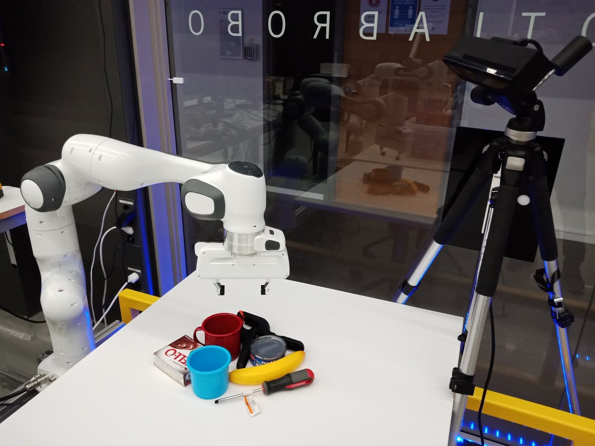

## Install
Require full ROS installation. The installation assumes you have Ubuntu 16.04 LTS [ROS Kinetic]
1. install franka_ros from source first: https://github.com/votegrasp/real_robot_grasping/tree/master/franka_ros
2. then install this: https://github.com/votegrasp/real_robot_grasping/tree/master/panda_demos
3. sudo apt-get install ros-kinetic-joint-state-controller
4. sudo apt install ros-kinetic-moveit
5. sudo apt-get install ros-kinetic-ros-control* ros-kinetic-gazebo-ros-control



## To start a Panda and an RGBD camera simulation:
   ```bash
   $ roslaunch panda_table_description panda_gazebo_asus.launch
   ```
## To start grasp detection:
   ```bash
   $ roslaunch grasp_detection grasp_detection.launch
   ```
## To start planning for a grasp:
   ```bash
   $ rosrun grasp_detection execute_grasp_node
   ```
   ```bash
   To test this node, run:
   $ rostopic pub /votegrasp/grasp std_msgs/Float64MultiArray """
    layout:
        dim: []                                
    data: [-0.29, -0.25, 1.3, 180, 0, 90, 0.06]
    """
   ```
## Calibration:
https://github.com/jhu-lcsr/aruco_hand_eye <br/>
https://blog.csdn.net/qq_39367282/article/details/89515338?fbclid=IwAR0X1oSc6uy8wauFOOVeNuvXCrIlqtXAn5vyoJm6peQoXf0zKQ3FVYm6eX0
